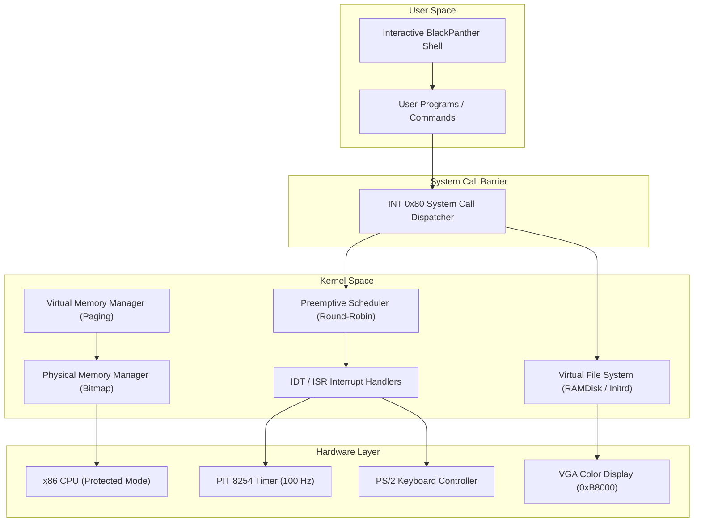

<div align="center">

# 🐾 BLACKPANTHER OS ⚡
### *A 32-Bit x86 Preemptive Multitasking Operating System Kernel*

[](https://en.wikipedia.org/wiki/C_(programming_language))
[](https://en.wikipedia.org/wiki/X86_assembly_language)
[-purple.svg?style=for-the-badge&logo=cpu)](https://en.wikipedia.org/wiki/IA-32)
[](https://www.qemu.org/)
[](https://www.gnu.org/software/make/)
[](LICENSE)

<p align="center">
  <b>BlackPanther OS</b> is a low-level, monolithic operating system kernel engineered from scratch for the x86 architecture. Designed for academic research, system efficiency, and deep exploration of operating system fundamentals including virtual memory management, interrupt handling, preemptive multitasking, virtual file systems, and hardware drivers.
</p>

[Key Features](#-key-features) •
[Architecture](#-system-architecture) •
[Directory Structure](#-repository-structure) •
[Getting Started](#-building--running) •
[Team Members](#-team-members) •
[Roadmap](#-project-roadmap)

---

</div>

## 📌 Project Overview

**BlackPanther OS** (OSSP S6) is built to demonstrate modern kernel design patterns on x86 bare-metal / virtualized hardware. It transitions from legacy 16-bit Real Mode into 32-bit Protected Mode, establishes paging-based memory isolation, handles hardware and software interrupts via a custom IDT, schedules tasks using a Round-Robin preemptive scheduler, and provides an interactive command line interface (CLI).

> [!IMPORTANT]
> **Course Repository**: Operating Systems & Systems Programming (OSSP - S6)  
> **Target Platform**: `i686-elf` (x86 32-bit Protected Mode)  
> **Boot Standard**: Multiboot v1 Compliant (Bootable via GRUB / QEMU)

---

## 🔥 Key Features

<table>
  <tr>
    <td width="50%">
      <h3>⚙️ Kernel Core & Bootstrapping</h3>
      <ul>
        <li><b>Multiboot Compliant:</b> Handoff from GRUB/QEMU directly into 32-bit Protected Mode.</li>
        <li><b>GDT & IDT Setup:</b> Configures Global Descriptor Table and Interrupt Descriptor Table with 32 ISRs and 16 IRQs.</li>
        <li><b>PIC Remapping:</b> Dual 8259A Programmable Interrupt Controllers mapped to vector offsets <code>0x20-0x2F</code>.</li>
      </ul>
    </td>
    <td width="50%">
      <h3>🧠 Memory Management</h3>
      <ul>
        <li><b>Physical Memory Manager (PMM):</b> Page frame allocation based on bitmap bitsets.</li>
        <li><b>Virtual Memory Manager (VMM):</b> 2-level Paging engine (Page Directory & Page Tables).</li>
        <li><b>Kernel Heap Allocator:</b> Custom <code>kmalloc</code> and <code>kfree</code> using memory pool chunking.</li>
      </ul>
    </td>
  </tr>
  <tr>
    <td width="50%">
      <h3>⚡ Process & Scheduler</h3>
      <ul>
        <li><b>Process Control Block (PCB):</b> Manages register states, PIDs, heap pointers, and process state.</li>
        <li><b>Preemptive Multitasking:</b> Context switching driven by Programmable Interval Timer (PIT @ 100Hz).</li>
        <li><b>System Calls:</b> Software interrupt <code>INT 0x80</code> handling <code>fork</code>, <code>exec</code>, <code>exit</code>, <code>yield</code>.</li>
      </ul>
    </td>
    <td width="50%">
      <h3>📂 Storage & Drivers</h3>
      <ul>
        <li><b>Virtual File System (VFS):</b> Unified interface for files, directories, and mounts.</li>
        <li><b>RAMDisk (Initrd):</b> In-memory filesystem image loaded during boot stage.</li>
        <li><b>Hardware Drivers:</b> VGA 80x25 text driver with color attributes, PS/2 keyboard ring buffer, and COM1 serial port logging.</li>
      </ul>
    </td>
  </tr>
</table>

---

## 🏗️ System Architecture



---

## 📁 Repository Structure

```text
BlackPanther_OSSP_S6/
├── boot/
│   ├── boot.asm             # Multiboot header & Protected Mode entry point
│   └── setup_gdt.asm        # Low-level GDT loader assembly
├── kernel/
│   ├── main.c               # Kernel main initialization entry point
│   ├── gdt.c                # Global Descriptor Table initialization
│   ├── idt.c                # Interrupt Descriptor Table & ISR setup
│   ├── isr.asm              # Interrupt Service Routine assembly wrappers
│   ├── timer.c              # PIT 8254 timer driver (100Hz tick)
│   └── syscall.c            # INT 0x80 System Call implementation
├── mm/
│   ├── pmm.c                # Bitmap physical frame allocator
│   ├── vmm.c                # Page directory and page table manager
│   └── heap.c               # Kernel heap allocator (kmalloc / kfree)
├── drivers/
│   ├── vga.c                # VGA 80x25 text mode driver with color formatting
│   ├── keyboard.c           # PS/2 Keyboard IRQ1 driver with scan-code map
│   └── serial.c             # UART COM1 serial port logger
├── fs/
│   ├── vfs.c                # Virtual File System abstraction layer
│   └── initrd.c             # RAMDisk / Initial RAM filesystem driver
├── shell/
│   └── shell.c              # BlackPanther interactive CLI & commands
├── include/                 # Header files (*.h) for kernel modules
├── Makefile                 # Automated build script for kernel ELF & ISO
├── linker.ld                # Linker script placing kernel at 1MB offset
└── README.md                # Project documentation
```

---

## 🛠️ Building & Running

### Prerequisites

Ensure you have the following cross-compilation and simulation tools installed on your host system (Linux / WSL / MSYS2):

```bash
# Ubuntu / Debian setup
sudo apt update
sudo apt install -y build-essential nasm qemu-system-x86 grub-pc-bin xorriso gcc-multilib
```

### 1️⃣ Clone the Repository
```bash
git clone https://github.com/NLR-2007/BlackPanther_OSSP_S6.git
cd BlackPanther_OSSP_S6
```

### 2️⃣ Build the Kernel Binary
```bash
make all
```

### 3️⃣ Run in QEMU Emulator
```bash
make qemu
```

### 4️⃣ Create Bootable ISO Image
```bash
make iso
```

---

## 💻 BlackPanther Shell Commands

Once BlackPanther OS boots up into QEMU, the user is greeted with the `BlackPanther >` prompt. Available shell commands include:

| Command | Description | Example Usage |
| :--- | :--- | :--- |
| `help` | Display list of supported commands and system info | `help` |
| `clear` | Clear the VGA screen buffer | `clear` |
| `meminfo` | View physical memory stats, allocated frames, and heap usage | `meminfo` |
| `ps` | List running processes, thread IDs, and memory states | `ps` |
| `ls` | List files and directories in the Initrd RAMDisk | `ls /` |
| `cat` | Read and output text file contents | `cat readme.txt` |
| `echo` | Print text to stdout | `echo Hello BlackPanther OS` |
| `uptime` | Print system uptime driven by PIT timer ticks | `uptime` |
| `reboot` | Perform hardware reset via 8042 Keyboard Controller | `reboot` |

---

## 👥 Team Members

<div align="center">

| Avatar | Team Member Name | Registration / Roll No. | Primary Role & Contributions |
| :---: | :--- | :---: | :--- |
| 👑 | **Nimma Lokesh Reddy** | `2520030366` | **Lead Architect & Kernel Engineer**<br>*Bootloader, GDT/IDT Setup, Syscall Dispatcher* |
| ⚙️ | **Ramagiri Rishik Rao** | `2520030333` | **Memory & Systems Lead**<br>*PMM Bitmap Allocator, VMM Paging Engine, Kernel Heap* |
| 💻 | **Gaddam Sriram Reddy** | `2520030218` | **Scheduler & Drivers Engineer**<br>*Preemptive Scheduler, VGA & Keyboard Drivers, Shell* |

</div>

---

## 📈 Project Roadmap

- [x] **Phase 1**: Multiboot Assembly Header & GDT/IDT Initialization
- [x] **Phase 2**: ISR & IRQ Interrupt Controller Handling (8259 PIC + PIT Timer)
- [x] **Phase 3**: Physical Memory Manager (PMM) & Page Table VMM Setup
- [x] **Phase 4**: Kernel Dynamic Memory Heap (`kmalloc` / `kfree`)
- [x] **Phase 5**: Preemptive Round-Robin Scheduler & Process Context Switch
- [x] **Phase 6**: Virtual File System (VFS) & Initrd RAMDisk Implementation
- [x] **Phase 7**: Interactive BlackPanther Shell & Keyboard Driver
- [ ] **Phase 8**: User-Mode Ring 3 Context Handoff & Memory Isolation
- [ ] **Phase 9**: VBE High-Resolution Graphic Display Driver
- [ ] **Phase 10**: Basic Network Stack (RTL8139 NIC Driver)

---

## 📜 License

This project is released under the **MIT License**. Feel free to inspect, modify, and build upon this kernel for educational and research purposes.

---

<div align="center">

Made with ❤️ by **Team BlackPanther** for Operating Systems & Systems Programming (OSSP - S6)

</div>
